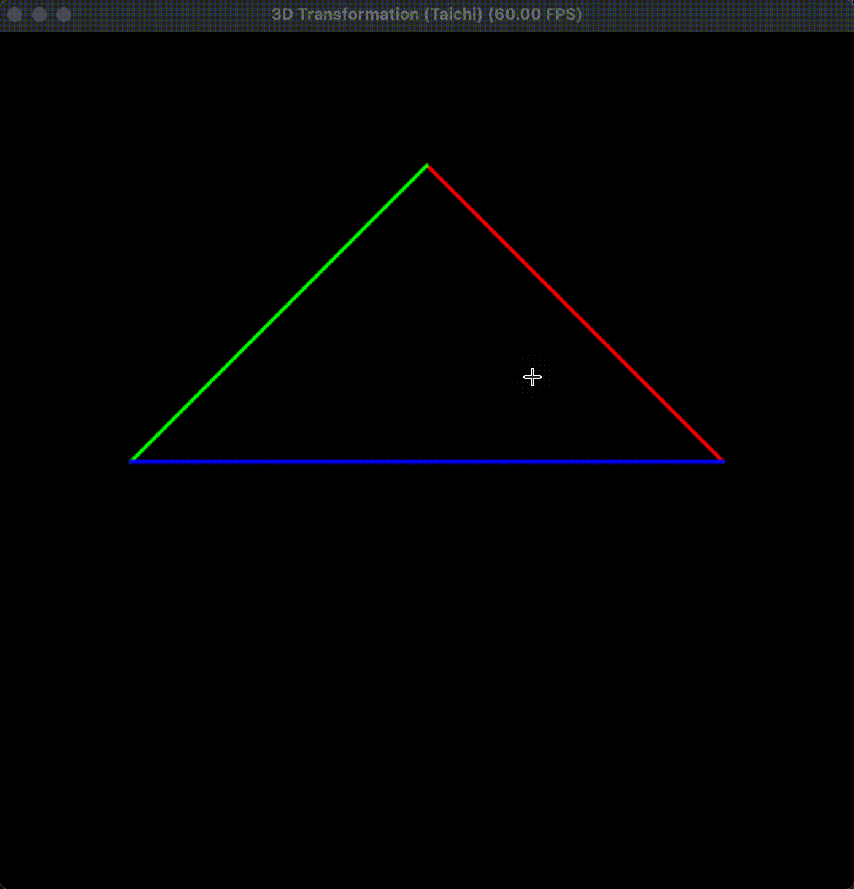

# 实验二：旋转与变换

龙彦汐-202411081077-人工智能


本次实验实现了从三维顶点到二维屏幕坐标的完整 MVP 变换流程。程序中定义了一个位于相机前方的三角形，先通过模型矩阵绕 Z 轴旋转，再通过视图矩阵把相机位置平移到原点，最后使用透视投影矩阵把相机空间坐标映射到规范化设备坐标。整个计算放在 Taichi kernel 中完成，屏幕端只负责根据计算后的二维坐标绘制三条彩色边。

模型矩阵按输入角度构造二维平面内的旋转，三角形的三个顶点在每次按键后都会重新经过同一套矩阵管线：

```python
@ti.func
def get_model_matrix(angle: ti.f32):
    rad = angle * math.pi / 180.0
    c = ti.cos(rad)
    s = ti.sin(rad)
    return ti.Matrix([
        [c, -s, 0.0, 0.0],
        [s,  c, 0.0, 0.0],
        [0.0, 0.0, 1.0, 0.0],
        [0.0, 0.0, 0.0, 1.0],
    ])
```

投影矩阵使用“透视到正交”的思路构造。由于相机朝向 `-Z` 方向，近远平面在相机空间中取负值，然后根据视场角、宽高比计算平截头体的上下左右边界：

```python
@ti.func
def get_projection_matrix(eye_fov: ti.f32, aspect_ratio: ti.f32, zNear: ti.f32, zFar: ti.f32):
    n = -zNear
    f = -zFar
    fov_rad = eye_fov * math.pi / 180.0
    t = ti.tan(fov_rad / 2.0) * ti.abs(n)
    b = -t
    r = aspect_ratio * t
    l = -r
    M_p2o = ti.Matrix([
        [n, 0.0, 0.0, 0.0],
        [0.0, n, 0.0, 0.0],
        [0.0, 0.0, n + f, -n * f],
        [0.0, 0.0, 1.0, 0.0]
    ])
    M_ortho = M_ortho_scale @ M_ortho_trans
    return M_ortho @ M_p2o
```

最终的变换顺序遵循列向量约定，即 `projection @ view @ model`。顶点乘以 MVP 矩阵后仍处于裁剪空间，需要先除以齐次坐标 `w` 完成透视除法，再把 NDC 的 `[-1, 1]` 区间映射到 Taichi GUI 使用的 `[0, 1]` 坐标：

```python
v_clip = mvp @ v4
v_ndc = v_clip / v_clip[3]
screen_coords[i][0] = (v_ndc[0] + 1.0) / 2.0
screen_coords[i][1] = (v_ndc[1] + 1.0) / 2.0
```

## 运行方式

```bash
cd work2
uv run python main.py
```

## 结果说明

运行后会出现黑色背景窗口，中间显示由红、绿、蓝三条边组成的线框三角形。连续按 `A` 或 `D` 可以让三角形绕自身中心旋转，按 `Esc` 退出程序。实验结果说明模型变换、视图变换、透视投影、透视除法和视口映射都能按预期工作。


