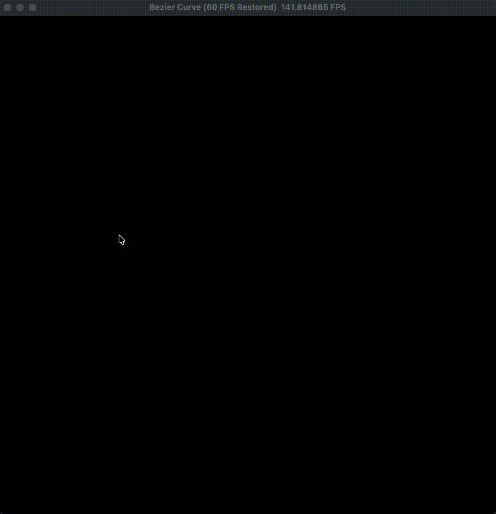

# 实验三：Bézier 曲线

龙彦汐-202411081077-人工智能


本次实验实现了一个交互式 Bézier 曲线绘制程序。鼠标左键点击画布时，程序会记录一个新的控制点；当控制点数量达到两个以上时，程序在参数区间 `[0, 1]` 上均匀采样曲线，并把采样点绘制到像素缓冲区中。控制点和控制多边形用于辅助观察曲线形状，绿色曲线表示实际插值得到的 Bézier 曲线。

曲线计算使用 De Casteljau 算法。这个算法的思路是对相邻控制点不断做线性插值，每一层都会减少一个点，最后剩下的点就是参数 `t` 对应的曲线位置。实现时使用迭代写法，避免控制点较多时递归调用过深：

```python
def de_casteljau(points, t):
    work = np.array(points, dtype=np.float32)
    count = len(work)
    for level in range(1, count):
        work[:count - level] = (1.0 - t) * work[:count - level] + t * work[1:count - level + 1]
    return work[0]
```

为了保证交互流畅，曲线采样和像素绘制做了分工。Python 端只在控制点变化时重新计算 `NUM_SEGMENTS + 1` 个曲线点，然后写入 `curve_points_field`；真正点亮像素的过程放在 Taichi kernel 中并行执行：

```python
@ti.kernel
def draw_curve_kernel(n: ti.i32):
    for i in range(n):
        pt = curve_points_field[i]
        x_pixel = ti.cast(pt[0] * WIDTH, ti.i32)
        y_pixel = ti.cast(pt[1] * HEIGHT, ti.i32)
        if 0 <= x_pixel < WIDTH and 0 <= y_pixel < HEIGHT:
            pixels[x_pixel, y_pixel] = ti.Vector([0.0, 1.0, 0.0])
```

另外，`canvas.circles()` 和 `canvas.lines()` 更适合读取定长 field，所以程序准备了固定大小的控制点缓冲池。未使用的位置放到画面外，实际控制点通过索引数组连成折线。这样既保留了交互式添加控制点的灵活性，也能适配 Taichi UI 的批量绘制接口。

## 运行方式

```bash
cd work3
uv run python main.py
```

## 结果说明

窗口打开后，依次点击不同位置可以添加红色控制点；相邻控制点之间显示灰色控制多边形，绿色 Bézier 曲线会随控制点变化实时更新。按 `C` 可以清空画布并重新绘制。录屏中展示了从少量控制点到多控制点曲线的变化过程，曲线始终保持经过首尾控制点并受中间控制点牵引的 Bézier 曲线特征。


