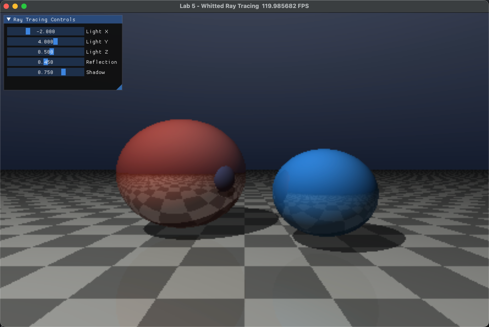

# 实验五：Whitted-Style 光线追踪

龙彦汐-202411081077-人工智能


本次实验在实验四的光线投射基础上加入了 Whitted-Style 光线追踪中的阴影和反射。场景由一个棋盘格地面、一个红色球体和一个蓝色球体组成。地面颜色根据交点的 `x`、`z` 坐标交替变化，因此不需要额外纹理文件也能得到棋盘格效果；两个球体和地面则通过不同的反射系数表现出材质差异。

每个像素首先发射一条主光线，调用 `scene_hit()` 查找最近命中物体。该函数统一返回命中距离、法线、基础颜色和镜面反射系数，后续着色阶段就不需要关心具体命中了哪一种几何体：

```python
@ti.func
def scene_hit(ro, rd):
    t = MAX_DIST
    normal = ti.Vector([0.0, 1.0, 0.0])
    color = ti.Vector([0.0, 0.0, 0.0])
    mirror = 0.0
    ts = hit_sphere(ro, rd, ti.Vector([-0.7, -0.05, -3.1]), 0.72)
    if ts < t:
        t = ts
        p = ro + rd * t
        normal = norm(p - ti.Vector([-0.7, -0.05, -3.1]))
        color = ti.Vector([0.95, 0.28, 0.18])
        mirror = reflection_strength[None]
    tp = hit_plane(ro, rd)
    if tp < t:
        t = tp
        p = ro + rd * t
        checker = (ti.floor(p.x * 2.0) + ti.floor(p.z * 2.0)) % 2.0
        color = ti.Vector([0.75, 0.75, 0.72]) * (0.55 + 0.35 * checker)
        mirror = 0.08
    return t, normal, color, mirror
```

阴影通过 shadow ray 实现。命中点沿法线方向稍微偏移后，再向光源发射一条射线；如果这条射线在到达光源前先打到其他物体，就说明该点处于阴影中，需要降低局部光照：

```python
@ti.func
def visible_to_light(p, n, light):
    to_light = light - p
    dist = to_light.norm()
    rd = to_light / (dist + 1e-6)
    t, _, _, _ = scene_hit(p + n * EPS * 4.0, rd)
    return ti.select(t < dist, 1.0 - shadow_strength[None], 1.0)
```

反射部分使用固定次数循环代替递归，这更符合 Taichi kernel 的写法。每次命中后，程序先按当前吞吐量累积局部漫反射光照，再根据镜面反射系数更新吞吐量，并把射线方向改为关于法线的反射方向：

```python
final += throughput * local * (1.0 - mirror)
throughput *= mirror
rd = norm(rd - 2.0 * rd.dot(n) * n)
ro = p + n * EPS * 4.0
```

窗口提供光源位置、反射强度和阴影强度的滑动条。光源移动时，阴影方向和受光面会同步变化；提高反射强度后，红色球体的镜面反射贡献更明显。每条二次射线和阴影射线都会做 `EPS` 偏移，用来减少自相交导致的黑斑或错误遮挡。

## 运行方式

```bash
cd work5
uv run python main.py
```

## 结果说明

运行后可以看到棋盘格地面、两个球体、投影阴影以及有限次数反射效果。默认画面中红色球体反射较强，蓝色球体反射较弱，地面有轻微反射；移动光源后阴影会跟随变化。截图和录屏展示了实验要求中的阴影、反射和交互调参效果。



