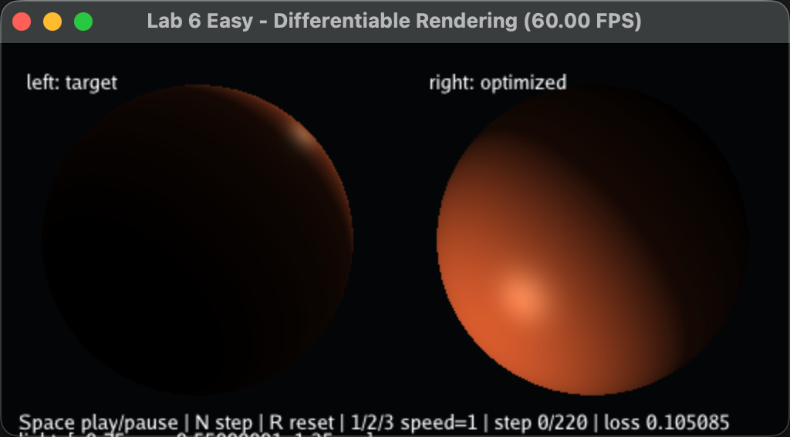
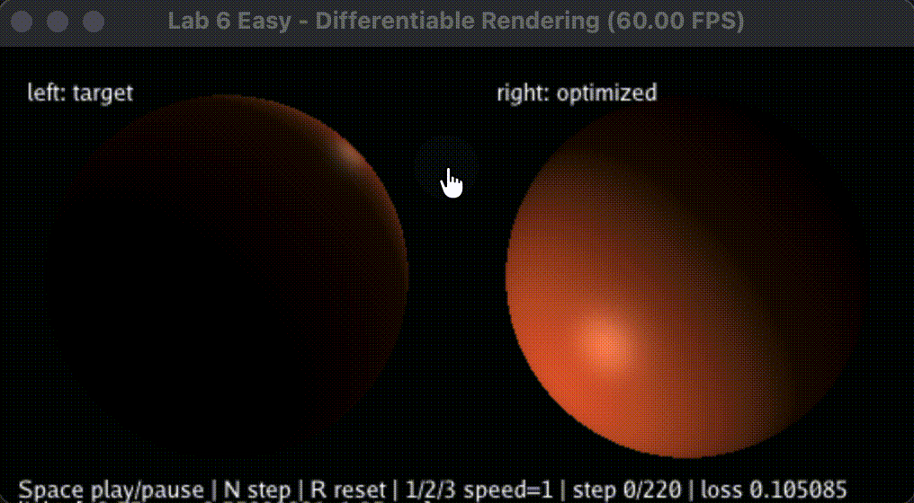

# 实验六：可微渲染（低难度版本）

龙彦汐-202411081077-人工智能


本次实验实现了一个低难度版本的可微渲染优化过程：先用固定目标光源位置 `(0.85, 0.85, 0.18)` 渲染左侧目标图像，再把待优化光源初始化到 `(-0.75, -0.55, 1.25)`，通过反向传播不断调整光源位置，使右侧当前渲染结果逐渐接近目标图像。优化目标是当前图像和目标图像之间的均方误差。

渲染对象是一个简化球面。为了让光源初始位置较差时仍然能够产生有效梯度，漫反射项没有直接使用普通 Lambert 的截断结果，而是使用 Leaky Lambertian：当 `n·l` 为负时仍保留一小部分线性响应。这样可以减少背光区域梯度完全消失的问题：

```python
@ti.func
def leaky_lambert(ndotl):
    return ti.select(ndotl >= 0.0, ndotl, 0.12 * ndotl)

@ti.func
def shade(i, j, light_pos):
    l = norm(light_pos - p)
    ndotl = n.dot(l)
    intensity = 0.10 + 0.90 * leaky_lambert(ndotl)
    spec = ti.pow(ti.max(half_vec.dot(n), 0.0), 48.0)
    return base_color * intensity + highlight_color * spec * 0.24
```

反向传播和参数更新集中在单步优化函数中。每一步先清空 loss，再用 `ti.ad.Tape` 记录当前渲染和误差计算，随后使用 Adam 更新光源坐标：

```python
def optimize_one_step(step: int) -> float:
    clear_loss()
    with ti.ad.Tape(loss):
        render_current()
        compute_loss()
    value = float(loss[None])
    adam_update(step)
    return value
```

Adam 更新维护一阶、二阶动量，并在更新后清空 `light.grad`，避免梯度累积影响下一步。显示窗口左侧为目标图像，右侧为当前优化结果；程序启动后默认暂停，方便先观察初始差异。按空格开始或暂停优化，按 `N` 可以单步前进，按 `R` 重置，按 `1/2/3` 可以切换每帧执行的优化步数。

## 运行方式

```bash
cd work6
uv run python main.py
```

## 结果说明

运行后右侧图像一开始与左侧目标图像有明显差异，尤其是高光位置和明暗分布不一致。开始优化后，光源坐标会逐步向目标光源靠近，右侧图像的高光和受光区域也会移动到与目标更接近的位置，同时窗口底部显示的 loss 会下降。录屏展示了从暂停初始状态到连续优化收敛的过程。




