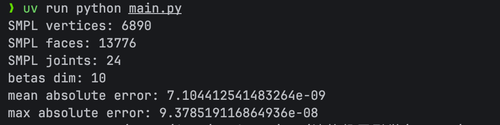
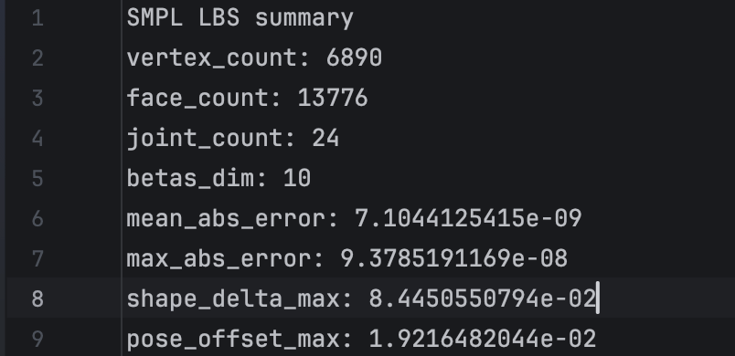
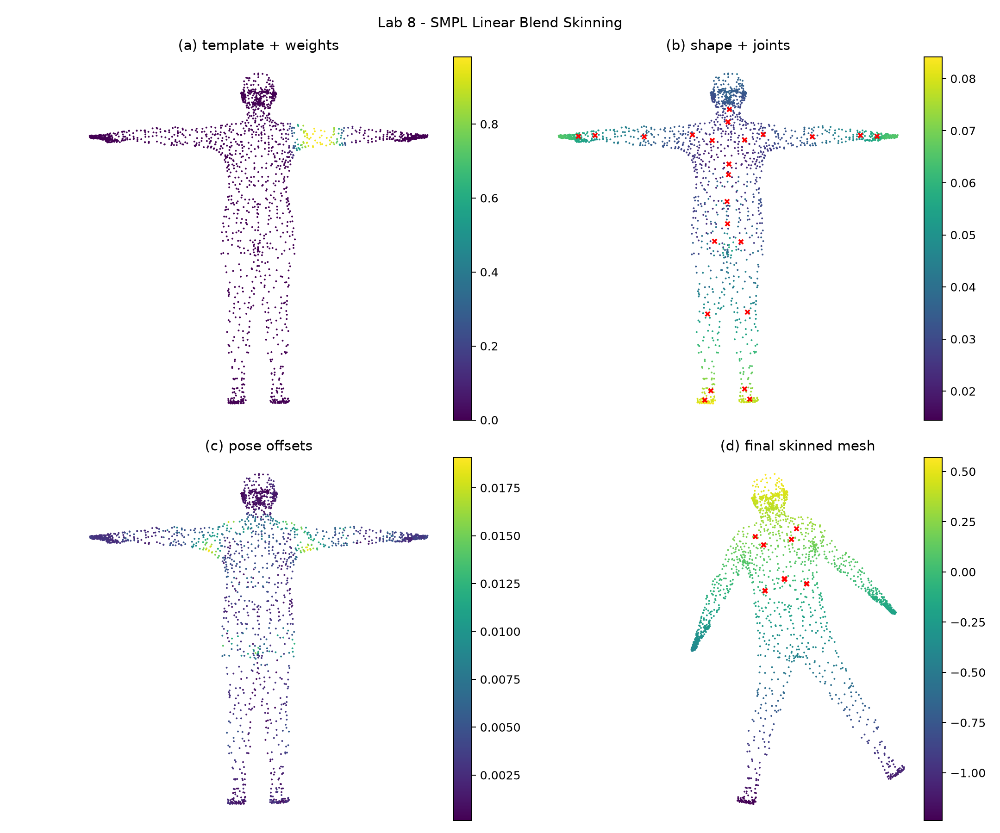

# 实验八：SMPL LBS 蒙皮

龙彦汐-202411081077-人工智能


本次实验基于 `SMPL_NEUTRAL.pkl` 展示 Linear Blend Skinning 的完整计算过程。程序直接读取 SMPL 文件中的模板顶点、形状基、姿态基、关节回归器、蒙皮权重、运动学树和面片数据，并额外调用 `smplx.create()` 得到官方前向结果，用来验证手写 LBS 实现是否一致。最终输出每个阶段的单独图片、一张 `2 × 2` 总结图，以及误差统计文件。

SMPL 文件中包含一些旧版本 pickle 依赖，程序在读取前对 `inspect.getargspec` 和部分 NumPy 旧别名做兼容处理。加载后把稀疏矩阵统一转成 `numpy.ndarray`，同时从 `kintree_table` 解析 24 个关节的父子关系：

```python
def load_smpl_data(path: Path = DATA_PATH) -> dict[str, np.ndarray]:
    patch_legacy_pickle_deps()
    with path.open("rb") as file:
        raw = pickle.load(file, encoding="latin1")
    kintree = np.asarray(raw["kintree_table"], dtype=np.int64)
    parents = np.zeros(24, dtype=np.int64)
    id_to_col = {int(kintree[1, i]): i for i in range(kintree.shape[1])}
    parents[0] = -1
    for i in range(1, 24):
        parents[i] = id_to_col[int(kintree[0, i])]
    return {
        "v_template": as_array(raw["v_template"]),
        "shapedirs": as_array(raw["shapedirs"])[:, :, :10],
        "posedirs": as_array(raw["posedirs"]),
        "J_regressor": as_array(raw["J_regressor"]),
        "weights": as_array(raw["weights"]),
        "faces": np.asarray(raw["f"], dtype=np.int64),
        "parents": parents,
    }
```

实验流程按 LBS 的计算顺序展开。第一阶段显示模板网格和指定关节的蒙皮权重，同时生成主导关节分布图，用来观察不同身体区域主要受哪些关节控制。第二阶段设置非零 `betas`，通过 `shapedirs` 得到形状变化后的 `v_shaped`，再用 `J_regressor` 回归新的关节位置。第三阶段设置非零姿态，把 axis-angle 转成旋转矩阵，构造 `R-I` 的 pose feature，并通过 `posedirs` 得到姿态校正位移。

手写 LBS 的核心在 `manual_lbs()` 中完成。程序先沿运动学树计算每个关节的全局刚体变换，再把每个顶点的蒙皮权重作为系数，对 24 个关节变换做加权混合：

```python
v_shaped = shaped_vertices(v_template, shapedirs, betas)
joints = regressor @ v_shaped
rotations = batch_rodrigues(pose)
offsets = pose_offsets(posedirs, rotations)
v_posed = v_shaped + offsets
transforms = global_rigid_transforms(rotations, joints, parents)
blended = np.tensordot(weights, transforms, axes=([1], [0]))
v_homo = np.concatenate([v_posed, np.ones((v_posed.shape[0], 1))], axis=1)
v_lbs = np.einsum("vij,vj->vi", blended, v_homo)[:, :3]
```

其中 `global_rigid_transforms()` 会先计算每个关节相对于父关节的局部变换，再逐级累乘成全局变换，并减去初始骨架带来的平移影响。最后的 `np.einsum()` 相当于把每个顶点的齐次坐标乘上自己的混合变换矩阵，得到最终蒙皮后的顶点位置。

为了确认实现正确性，程序使用同一组 `betas`、`global_orient` 和 `body_pose` 调用官方 SMPL 前向，并逐顶点比较手写结果和官方结果。当前输出中顶点数为 6890，面片数为 13776，关节数为 24，平均绝对误差约为 `7.10e-09`，最大绝对误差约为 `9.38e-08`，说明手写 LBS 与官方实现基本一致。

## 运行方式

```bash
cd work8
MPLBACKEND=Agg uv run python main.py
```

## 结果说明

运行后终端会输出模型规模和误差统计，图片文件保存在 `outputs/` 目录中。`stage_a_template_weights.png` 展示模板网格和肩部权重，`stage_b_shaped_joints.png` 展示形状变化及回归关节，`stage_c_pose_offsets.png` 展示姿态校正位移，`stage_d_lbs_result.png` 展示最终蒙皮结果。`lbs_summary.png` 与 `outputs/comparison_grid.png` 内容一致，便于在报告中查看完整流程。




